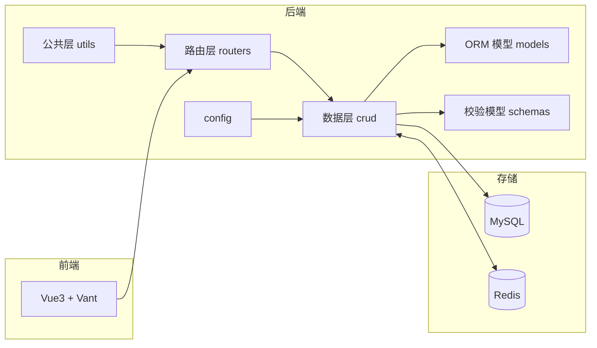

# 架构设计

> 头条资讯网站（Vue + FastAPI）：类「今日头条」的资讯类全栈项目。
> 本文描述后端系统架构、分层设计、请求数据流与核心机制，供开发、评审与对外文档使用。

## 1. 系统概览

前后端分离架构：

- **前端**：Vue 3 + Vite + Vant，运行于 5173 端口（开发）/ Nginx 静态托管（生产）。
- **后端**：FastAPI 提供 RESTful API，携带 CORS 配置以支持跨域联调。
- **数据层**：MySQL 负责业务数据持久化；Redis 承担高频读缓存。

```
┌─────────┐        ┌──────────────────────────────┐        ┌─────────────┐
│  Vue 前端 │  HTTP  │        FastAPI 后端          │  SQL    │     MySQL    │
│ (Vite/   │ ─────▶ │  routers → crud → models     │ ─────▶ │ (aiomysql)   │
│  Vant)   │◀───── │  schemas / utils / config    │        │  async       │
└─────────┘  JSON  └──────────┬───────────────────┘        └─────────────┘
                              │ Redis (Cache-Aside)
                              ▼
                        ┌─────────────┐
                        │    Redis     │
                        └─────────────┘
```

## 2. 分层架构

后端采用四层分层设计，职责清晰、便于扩展：

| 层 | 目录 | 职责 |
| --- | --- | --- |
| 路由层 | `routers/` | 定义接口、统一路径前缀与响应格式，做参数校验与鉴权 |
| 数据操作层 | `crud/` | 封装对数据库的增删改查，供路由层调用 |
| ORM 模型层 | `models/` | 定义数据库表结构与关系映射 |
| 校验模型层 | `schemas/` | 定义请求 / 响应的 Pydantic 校验模型 |
| 公共层 | `utils/ config/ cache/` | 鉴权、密码加密、统一响应、全局异常、DB/Redis 配置 |

数据流：`前端请求 → 路由层(get_current_user 鉴权) → crud 层(数据库/缓存) → 返回统一响应`。

## 3. 功能模块

| 模块 | 路由前缀 | 功能 |
| --- | --- | --- |
| 新闻 | `/api/news` | 分类、分页列表、详情（浏览量+1）、相关推荐 |
| 用户 | `/api/user` | 注册、登录、信息查询/修改、修改密码 |
| 收藏 | `/api/favorite` | 状态校验、添加/取消、分页列表、清空 |
| 历史 | `/api/history` | 添加记录、分页列表、单条删除、清空 |

## 4. 核心机制

### 4.1 分层 Mermaid 图



### 4.2 鉴权机制

- 用户注册 / 登录后生成 token 写入 `user_token` 表。
- 通过 `HTTPBearer` 依赖注入解析请求头 `Authorization: Bearer <token>`。
- `get_current_user` 依据 token 查询用户，未携带或已过期返回 401。

### 4.3 缓存机制（Cache-Aside）

新闻分类与列表采用「先读缓存、未命中再读库并回写」策略：

1. 请求 → 读 Redis；
2. 命中直接返回；
3. 未命中 → 查 MySQL → 序列化写入 Redis → 返回。

### 4.4 数据约束与索引

- 收藏表：`UniqueConstraint(user_id, news_id)`，杜绝重复收藏。
- 对高频查询字段建立索引：`news(category_id)`、`news(publish_time)`、`favorite(user_id/news_id)`、`history(user_id/news_id/view_time)`。

### 4.5 通用响应与异常处理

- 统一响应：`{ "code": 200, "message": "success", "data": ... }`。
- 全局异常：业务 `HTTPException`、`IntegrityError`、`SQLAlchemyError`、兜底 `Exception` 分别注册处理器，返回一致结构。

## 5. 技术选型说明

| 技术 | 选型理由 |
| --- | --- |
| FastAPI | 异步、类型校验（Pydantic）、自动生成 Swagger 文档 |
| SQLAlchemy 2.0 | 异步 ORM + `aiomysql`，类型化 `Mapped` 模型 |
| MySQL 8 | 存储业务数据，utf8mb4 支持中文 |
| Redis | 缓存高频读接口，降低数据库压力 |
| JWT + bcrypt | 无状态鉴权 + 密码哈希，兼顾安全与性能 |
